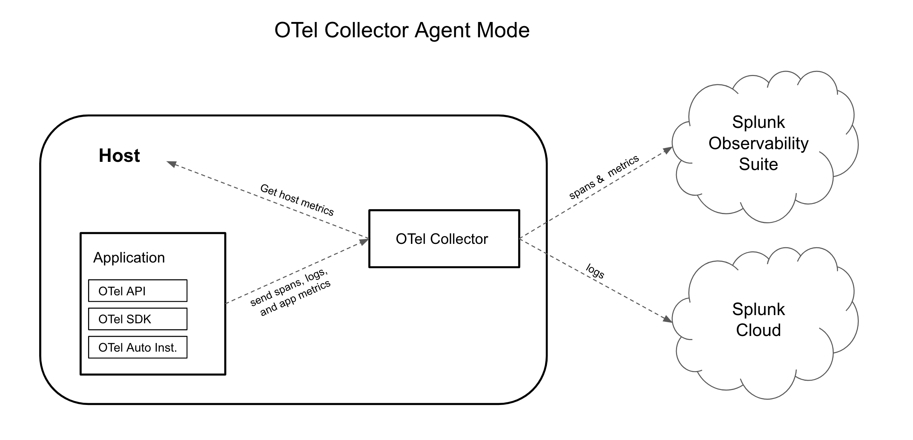
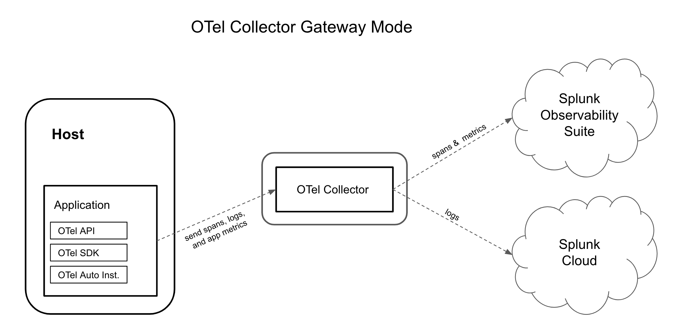
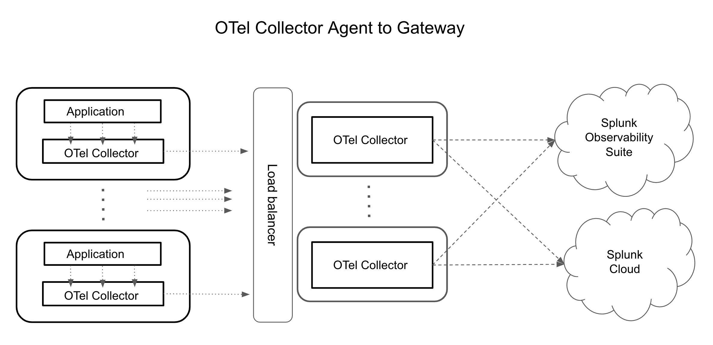

The OpenTelemetry collectors can be deployed in two deployment modes: agent mode, and gateway mode. 
 
## Agent Mode

In agent mode, the Collector runs on the same host as the application. It can be configured to send data directly to Splunk Observability, or to an OTel collector deployed as a standalone service (Gateway mode). 

In agent mode the collector is able to collect host and application metrics, as well as apply metadata enrichment for metrics, spans and logs. 

   

## Gateway Mode 

In Gateway mode the collector is deployed as a stand alone service. This deployment model allows you to perform more advanced configurations, and it is typically deployed per cluster, data center or region. Multiple collectors can be deployed together with a load balancer to create a more resilient data pipeline. 

   

   