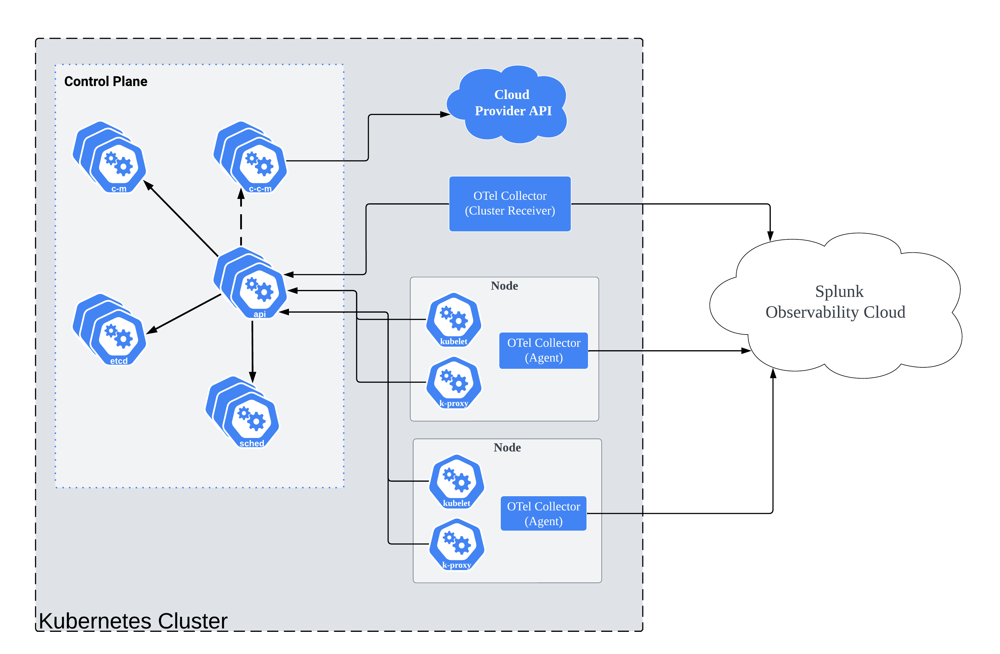

The Collector configuration is stored in a YAML file that specifies the characteristics and behavior of the following elements:

- Extensions: Extend the capabilities of the Collector.

- Receivers: Determine how you’ll get data into the Collector.

- Processors: Configure which operations you’ll perform on data before it’s exported. For example, filtering.

- Exporters: Set up where to send data to. It can be one or more backends or destinations.

- Services. It consists of two elements:

  - List of the extensions you’ve configured.

  - Pipelines: Path data will follow from reception, then through processing or modification, and finally exiting through exporters.


## Configuring a Pipeline

A pipeline can contain one or more receivers. Data from all receivers is pushed to the first processor, which performs processing on it and then pushes it to the next processor and so on until the last processor in the pipeline pushes the data to the exporters. Each exporter gets a copy of each data element. The last processor uses a data fan-out connector to fan out (distribute) the data to multiple exporters.

Here is an example of how a configuration structure would look like 
````
receivers:
  otlp:
    protocols:
      grpc:
      http:

processors:
  batch:

exporters:
  otlp:
    endpoint: otelcol:4317

extensions:
  health_check:
  pprof:
  zpages:

service:
  extensions: [health_check,pprof,zpages]
  pipelines:
    traces:
      receivers: [otlp]
      processors: [batch]
      exporters: [otlp]
    metrics:
      receivers: [otlp]
      processors: [batch]
      exporters: [otlp]
    logs:
      receivers: [otlp]
      processors: [batch]
      exporters: [otlp]
````  


## YAML Locations 

There are two common ways to install the Splunk OTel Collector: 

- Installer Script: This is normally used for individual Linux or Windows hosts. The default location of the yaml config file will be: 
    - Linux: `/etc/otel/collector/agent_config.yaml`

    - Windows: `%PROGRAMFILES\Splunk\OpenTelemetry Collector\agent_config.yaml`  

- Helm Chart: This is used to install the collector in Kubernetes environments. To configure the the collector we will create a values.yaml file and use it to deploy our Helm Chart. 

## Helm Chart Deployment

The Helm Chart deployment mode is more complex as it sets up an advanced configuration in order to gain full visiblity into a Kubernetes Cluster. By default the Helm Chart will deploy two seperate Collector deployments: 
- Cluster Receiver: The cluster receiver collector intereacts with the [Kubernetes API](https://kubernetes.io/docs/concepts/overview/kubernetes-api/) to collect cluster level metrics. All the metrics that go through the Cluster Receiver start with "Kubernetes.*" oftens abbreviated as "k8s.*" within Splunk Observability. See the full [list of metrics](https://docs.splunk.com/Observability/gdi/opentelemetry/components/kubernetes-cluster-receiver.html#nav-Kubernetes-cluster-receiver)
- Deamonset Agent: An agent Collector runs in every node collecting metrics, traces, and logs for all pods and containers running within the node. 

The third pipeline is a Gateway Collector which is not deployed by default. It is important to understand which metric you are working with and which pipeline that metrics flows through when modifying processors. 

Example diagram of a Kubernetes Cluster and how each Collector is deployed. Keep in mind that all services to include the Cluster Receiver would run inside a node, it was not added in this diagram to make it easier to understand. 



## Configuring and Updating a Helm Chart Deployment

