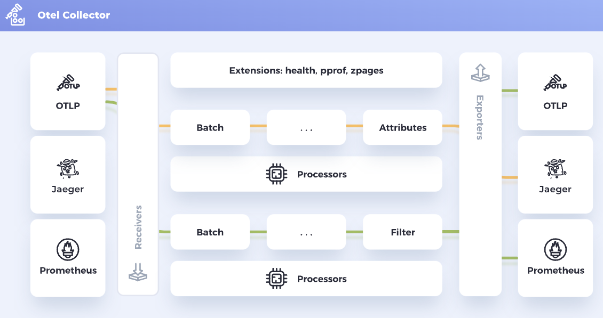

[The OpenTelemetry Collector](https://opentelemetry.io/docs/collector/) offers a vendor-agnostic implementation of how to receive, process and export telemetry data. It removes the need to run, operate, and maintain multiple agents/collectors. This works with improved scalability and supports open-source observability data formats (e.g. Jaeger, Prometheus, Fluent Bit, etc.) sending to one or more open-source or commercial back-ends. 

The collector is composed of three components: receivers, processors, and exporters. The OTel Collector can be used to build data pipelines which are configured via a YAML configuration. 

  

### Receivers

Receivers are used to configure and format data for the collector to ingest. The collector supports multiple formats such as Jaeger and Prometheus, but it primarly uses the [OpenTelemetry Protocol (OTLP)](https://opentelemetry.io/docs/reference/specification/protocol/) standard. Receivers can either push or pull data 
 
  
### Processors  

Processors are used for performing data processing on the data that is flowing through the collector. The collector is able to process data in a streaming matter or in batches. This gives processors the functionality to perform a wide array of tasks, some common uses cases are: event sampling, adding metadata, renaming or dropping data, remove or mask PII data, perform aggregations, .. etc 
   

### Exporters  

Exporters are used to export data to any location. Similar to how receivers work, exporters allow you to configure how the data is sent out from the collector. A collector can have multiple exporters, allowing it to simultinaously send data to multiple systems at the same time. 
